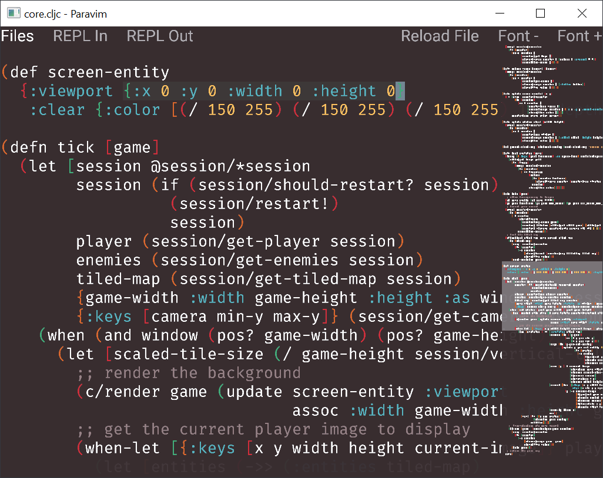

<p align="center">
  
</p>

## Introduction

Paravim is an editor for Clojure that...
* Runs *inside* your project as a library, not as a separate application like traditional editors
* Uses a [real copy of Vim](https://github.com/oakes/libvim-clj), not some kind of emulation
* Renders its UI [with OpenGL](https://github.com/oakes/play-cljc), not with a forked web browser

See [the website](https://sekao.net/paravim/) for more info and join the discussion on [/r/Paravim](http://www.reddit.com/r/Paravim).

## Getting Started

The easiest way to run it is with the [Clojure CLI tool](https://clojure.org/guides/getting_started#_clojure_installer_and_cli_tools). On Windows or Linux, run this in any directory you want:

```
clojure -Sdeps "{:deps {paravim {:mvn/version \""RELEASE\""}}}" -m paravim.start
```

On Mac OS, you need to add a special flag:

```
clojure -Sdeps "{:deps {paravim {:mvn/version \""RELEASE\""}}}" -J-XstartOnFirstThread -m paravim.start
```

NOTE: On Linux, there have been some `UnsatisfiedLinkError`s due to `libtinfo.5` not being present. If you have apt, try `apt install libtinfo5`. If you're on Arch, see [this issue](https://github.com/oakes/Paravim/issues/5) for a solution.

## Development

* To develop: `clj -A:dev native`
  * On Mac OS, you'll need to run `clj -A:dev:macos native`
* To run the tests: `clj -A:test`
  * On Mac OS, you'll need to run `clj -A:test:macos`
* To install the release version: `clj -A:prod install`

## Licensing

All files that originate from this project are dedicated to the public domain. I would love pull requests, and will assume that they are also dedicated to the public domain.
